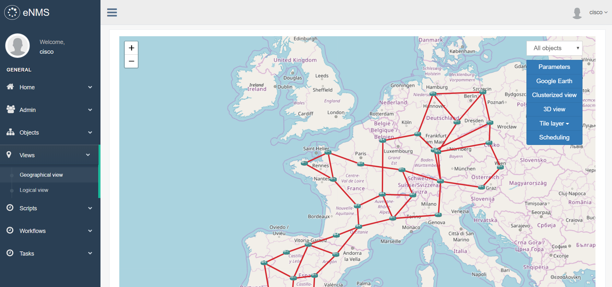
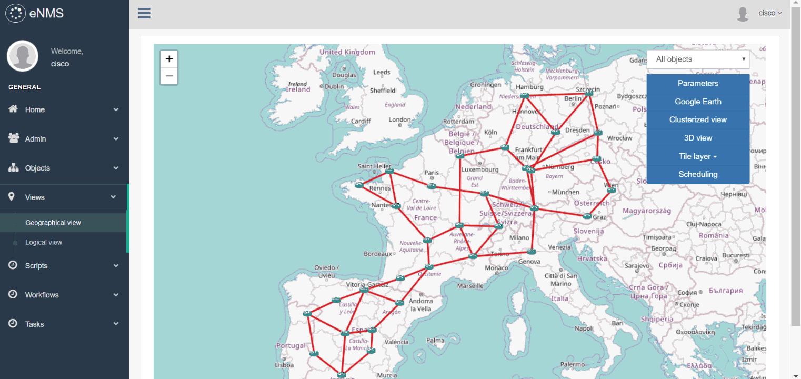
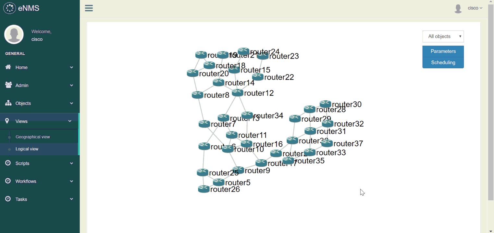

# Introduction

eNMS is an open source web application designed to help automate networks graphically.

It encompasses the following aspects of network automation:
- **Configuration management**: commit/rollback of a configuration via NAPALM.
- **Netmiko scripting**: using netmiko to push a configuration, or display the result of a set of commands.
- **Ansible support**: sending and managing ansible playbooks.
- **Workflows**: Netmiko, NAPALM and Ansible scripts can be combined together graphically to define a workflow (see below).
- **Scheduling**: any task can be scheduled to start and end at specific times, periodically or not.

While network automation traditionally requires scripting skills, eNMS provides a way to automate networks graphically, in a few simple steps: 
- **Creation** of the network (e.g by importing a spreadsheet describing the network topology)
- **Visualization** of the network on a world map (geographical view), or via a force-based algorithm (logical view).
- **Creation** of a script / workflow.
- **Scheduling** of the task from the geographical or logical view.

Join us on the [Network to Code slack](http://networktocode.herokuapp.com "Network to Code slack"), channel #enms for the latest updates !

# 1. Network creation

Nodes and links can be created either one by one by specifying all properties manually, or all at once by importing an Excel spreadsheet. Once created, all objects are displayed in a sortable and searchable table, from which they can be edited and deleted.

The dashboard provides a graphical overview of all objects with dynamic charts.

Try it out yourself: obj management + dashboard
Relevant part of the doc: _[Object creation](http://enms.readthedocs.io/en/latest/objects/creation.html)_

# 2. Network visualization

Two visualizations are proposed:
- **Geographical view**: display the network on a world map in 2D or 3D, with Open Street Map or Google Map (with `leaflet.js`).
- **Logical view**: display the network in an aesthetically-pleasing way via a force-based algorithm (with `d3.js`).

Views can be filtered to display only a subset of the network. A filter is a combination of values (or regular expressions) for each property: it defines whether an object should be displayed or not.

You can display the property of an object from both views, and start an SSH session to a device.

In the following example, we create a first filter with the regular expression `france|spain` for `location` to filter all _objects_ that are not in France or in Spain, and a second filter with the value `IOS-XR` for `Operating System` to filter all _nodes_ that do not have the `IOS-XR` operating system.
We use these filters on both views, then start an SSH session to one of the router.

Try it out yourself: both views + filter page
Relevant parts of the doc: _[Geographical view](http://enms.readthedocs.io/en/latest/views/geographical_view.html)_, _[Logical view](http://enms.readthedocs.io/en/latest/views/logical_view.html)_, _[Filters](http://enms.readthedocs.io/en/latest/objects/filtering.html)_, _[Bindings](http://enms.readthedocs.io/en/latest/views/bindings.html)_

# 3. Creation of scripts and workflows

The following types of script can be created:
- **Netmiko _configuration_**: list of commands to configure the device (plain text or Jinja2 template).
- **Netmiko _show commands_**: list of “show commands” which output is displayed in the task logs.
- **Netmiko _validation_**: list of command which output must contain a specific pattern (used in workflows).
- **NAPALM _configuration_ task**: partial or full configuration (plain text or Jinja2 template) of the device.
- **NAPALM _getters_**: list of getters which output is displayed in the task logs.
- **Ansible playbook**: send an ansible playbook with optional arguments.

Scripts can be combined to form a **workflow**. A workflow is a directed graph which nodes are scripts.
There are two types of edge in a workflow: `success edge` and `failure edge`. The success edge (resp. failure edge) indicates where to move in the graph if the source script was successfully executed (resp. failed).

In the following example, we create a workflow to configure a VRF on Cisco IOS. Our workflow is made of 4 scripts:
- `create_vrf`: uses NAPALM to configure a new VRF on the router (via `Load merge`)
- `NAPALM Commit`: commits the newly configured VRF.
- `validate_vrf`: uses Netmiko to verify that the state of the router is consistent with what is expected.
- `NAPALM Rollback`: use NAPALM to rollback the configuration if the previous validation fails (`validate_vrf` script).

Try it out yourself: script maangement + direct link to workflow
Relevant parts of the doc: _[Scripts](http://enms.readthedocs.io/en/latest/automation/scripts.html)_, _[Workflows](http://enms.readthedocs.io/en/latest/automation/workflows.html)_, _[OS upgrade workflow](http://enms.readthedocs.io/en/latest/automation/os_upgrade.html)_, 

# 4. Scheduling

Once a script / workflow has been created, a task can be scheduled from the graphical view.
The targets are selected graphically. Filters can be used to schedule a task on a specific subset of device.

The following parameters are available:
- **Frequency**: the task is executed periodically. This is especially useful for tasks that pull some information from the device, i.e netmiko **_show commands_** / **_NAPALM getters_** tasks.
- **Start date**: instead of running the task immediately, the task will start at a specific time.
- **End date**: used for a periodic task to stop at a specific time.

In the following example, we schedule the `configure_vrf` workflow created at the previous step.
All scheduling fields are left empty: the workflow is executed immediately.
The scripts of the workflow are executed one by one, except for `NAPALM Rollback` as the validation step does not fail.

Try it out yourself: both view + calendar
Relevant part of the doc: _[Scheduling](http://enms.readthedocs.io/en/latest/tasks/scheduling.html)_

# 5. Comparison of the results

The results of a periodic task can be compared between two different times, devices or tasks.
eNMS displays a dynamic line-by-line diff of the outputs.

In the following example, we schedule two periodic tasks:
- a `show-interfaces` task that will periodically run `show interfaces` on a router with Netmiko.
- a NAPALM getter task that will periodically retrieve the output of NAPALM `get_interfaces_counters` getter.
We can see in the comparison how counters increase through time for both tasks.

Try it out yourself: task management
Relevant part of the doc: _[Task results](http://enms.readthedocs.io/en/latest/tasks/management.html)_

# Miscellaneous

- eNMS can act as a TACACS+ authentication server: upon authentication, a request will be sent to the server to check the credentials and log in the user.
- eNMS can act as a Syslog server: all logs are stored in the database, and can be filtered with regular expressions. Eventually, the idea is to use the logs for event-driven automation, i.e trigger the execution of a script upon received a specific log.
- A network can be exported to Google Earth (as a `.kmz` file).

# Getting started

### (Optional) Set up a [virtual environment](https://docs.python.org/3/library/venv.html) 

### 1. Get the code
    git clone https://github.com/afourmy/eNMS.git
    cd eNMS

### 2. Install requirements 
    pip install -r requirements.txt

### 3. Run the code
    cd source
    python flask_app.py

### 4. Go the http://127.0.0.1:5100/

### 5. Create an account and log in

# Run eNMS in a docker container

### 1. Fetch the image on dockerhub
    docker pull afourmy/enms

### 2. Find the name of the docker image
    docker images

### 3. Run the image on port 5100
    docker run -p 5100:5100 image_name

# Contact

For any feedback, advice, feature request, join us on the [Network to Code slack](http://networktocode.herokuapp.com "Network to Code slack") (channel #enms)
