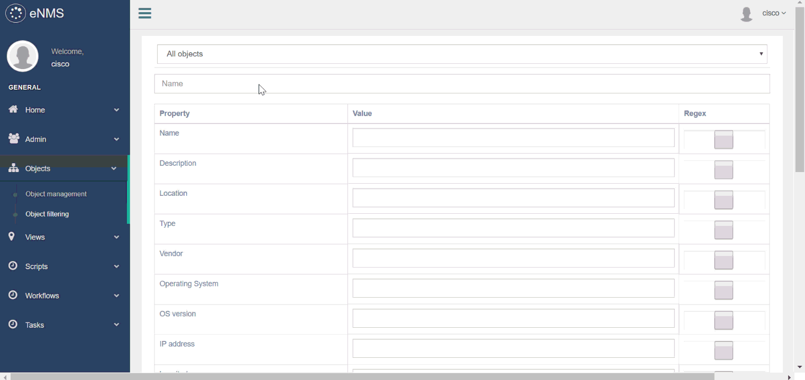
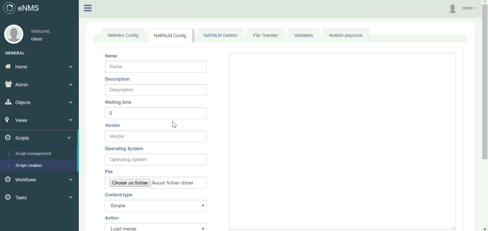

# Introduction

eNMS is an open source web application designed to help automate networks graphically.

It encompasses the following aspects of network automation:
- **Configuration management**: commit/rollback of a configuration via NAPALM.
- **Netmiko scripting**: using netmiko to push a configuration, or display the result of a set of commands.
- **Ansible support**: sending and managing ansible playbooks.
- **Scheduling**: any task can be scheduled to run at a specific time, periodically or not.

While network automation traditionally requires scripting skills, eNMS provides a way to automate networks graphically, in a few simple steps: 
- **Creation** of the network (e.g by importing a spreadsheet describing the network topology)
- **Visualization** of the network on a world map, or via a force-based algorithm.
- **Creation** of a script or a workflow.
- **Scheduling**: **Selection** of the target devices from the graphical view, and scheduling of the script or the workflow.

Join us on the [Network to Code slack](http://networktocode.herokuapp.com "Network to Code slack"), channel #enms for the latest updates !

# 1. Network creation

Nodes and links can be created either one by one by specifying all properties manually, or all at once by importing an Excel spreadsheet. Once created, all objects are displayed in a sortable and searchable table, from which they can be edited and deleted.

The dashboard provides a graphical overview of all objects with dynamic charts.

Relevant parts of the doc: _[Object creation](http://enms.readthedocs.io/en/latest/objects/creation.html)_

Check it out yourself: 

# 2. Network visualization

- **Geographical view**: you can display the network in 2D or 3D, with Open Street Map or Google Map (with `leaflet.js`).
- **Logical view**: the logical view uses a graph-drawing algorithm to create an optimal display (with `d3.js`).

Views can be filtered to display only a subset of the network. A filter is a combination of values (or regular expressions) for each property: it defines whether an object should be displayed or not.

You can display the property of an object from both views, and start an SSH session to a device.

In the following example, we create a first filter with the regular expression `france|spain` for `location` to filter all _objects_ that are not in France or in Spain, and a second filter with the value `IOS-XR` for `Operating System` to filter all _nodes_ that do not have the `IOS-XR` operating system.

Relevant parts of the doc:
- _[Geographical view](http://enms.readthedocs.io/en/latest/views/geographical_view.html)_
- _[Logical view](http://enms.readthedocs.io/en/latest/views/logical_view.html)_
- _[Filters](http://enms.readthedocs.io/en/latest/objects/filtering.html)_
- _[Bindings](http://enms.readthedocs.io/en/latest/views/bindings.html)_

Check it out yourself: 

# 3. Creation of scripts and workflows

The following types of script can be created:
- **Netmiko _configuration_**: list of commands to configure the device (plain text or Jinja2 template).
- **Netmiko _show commands_**: list of “show commands” which output will be displayed in the task logs.
- **Netmiko _validation_**: list of command which output must contain a specific pattern (used in workflows).
- **NAPALM _configuration_ task**: partial or full configuration (plain text or Jinja2 template) with `Load merge` or `Load replace`.
- **NAPALM _getters_**: list of getters which output will be displayed in the task logs.
- **Ansible playbook**: send an ansible playbook.

Scripts can be combined to form a **workflow**. A workflow is a directed graph which nodes are scripts. There are two types of edge in a workflow: `success edge` and `failure edge`. The success edge indicates where to move in the graph if the source script was executed with success, while the failure edge does the same thing in case of failure.

# 4. Scheduling

eNMS also provides some scheduling functions:
- **Start date**: instead of running the task immediately, the task will start at a specific time.
- **Frequency**: the task will be run periodically. This is especially useful for tasks that pull some information from the device, i.e netmiko **_show commands_** / **_NAPALM getters_** tasks.

### Comparison

For all periodic tasks, you can compare the results between any two devices, at two different times.

# Miscellaneous

- eNMS can act as a TACACS+ authentication server: upon authentication, a request will be sent to the server to check the credentials and log in the user.
- eNMS can act as a Syslog server: all logs are stored in the database, and can be filtered with regular expressions. Eventually, the idea is to use the logs for event-driven automation, i.e trigger the execution of a script upon received a specific log.
- A network can be exported to Google Earth (as a `.kmz` file).

# Getting started

### (Optional) Set up a [virtual environment](https://docs.python.org/3/library/venv.html) 

### 1. Get the code
    git clone https://github.com/afourmy/eNMS.git
    cd eNMS

### 2. Install requirements 
    pip install -r requirements.txt

### 3. Run the code
    cd source
    python flask_app.py

### 4. Go the http://127.0.0.1:5100/

### 5. Create an account and log in

# Run eNMS in a docker container

### 1. Fetch the image on dockerhub
    docker pull afourmy/enms

### 2. Find the name of the docker image
    docker images

### 3. Run the image on port 5100
    docker run -p 5100:5100 image_name

# Contact

For any feedback, advice, feature request, join us on the [Network to Code slack](http://networktocode.herokuapp.com "Network to Code slack") (channel #enms)
